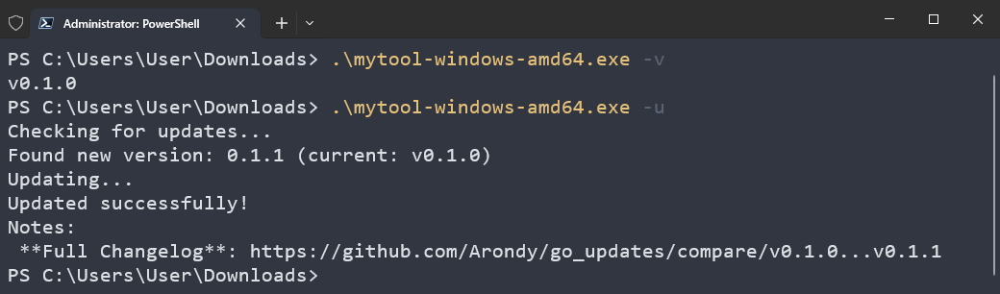

# Go Updates

A simple Go application demonstrating self-updating functionality from GitHub releases.

## Demo



## Features

- Automatic updates from GitHub releases
- Linux/Windows binaries
- Version checking and display
- SHA256 checksums for integrity verification

## Usage

Download any of **NON-**latest binary for your platform from the [Releases](https://github.com/Arondy/go_updates/releases) page to check out an update process.

### Basic Usage

```bash
./mytool
```

### Check for Updates

```bash
./mytool --update
# or
./mytool -u
```

### Show Version

```bash
./mytool --version
# or
./mytool -v
```

## Project Structure

```
.
├── main.go                 # Main application entry point
├── cli/cli.go             # Command-line argument parsing
├── updater/updater.go         # Update logic using go-selfupdate
├── .github/workflows/release.yml    # CI/CD pipeline for releases
└── README.md
```

## How Updates Work

1. The application checks GitHub releases for newer versions
2. If a newer version is found, it downloads the appropriate binary for the current platform
3. SHA256 checksums are verified for integrity
4. The old binary is replaced with the new one

## CI/CD

The project uses GitHub Actions for automated releases:

- On push to `main` branch, a new release is created
- Binaries are built for Linux and Windows
- SHA256 checksums are generated and included
- Release notes are automatically generated

## Dependencies

- [go-selfupdate](https://github.com/creativeprojects/go-selfupdate) - Self-updating library
